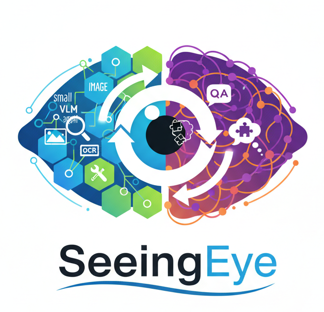
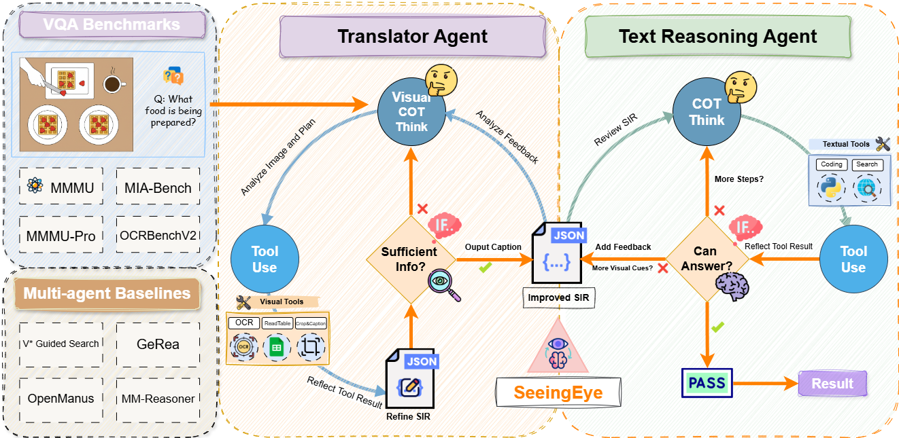

# SeeingEye: Agentic Information Flow Unlocks Multimodal Reasoning in Text-Only LLMs

This repository contains the official implementation for the paper **"SeeingEye: Agentic Information Flow Unlocks Multimodal Reasoning in Text-Only LLMs"**. The project demonstrates how text-only language models can achieve multimodal reasoning capabilities through sophisticated agentic information flow, using a multi-agent framework with specialized agents for vision and reasoning tasks.

<div align="center">
  

  **SeeingEye: Agentic Information Flow Unlocks Multimodal Reasoning in Text-Only LLMs**

  [](https://arxiv.org/abs/2510.25092)
  [](LICENSE)
</div>

## 📋 Table of Contents

- [Overview](#overview)
- [Installation](#installation)
- [Creating Custom Agents](#creating-custom-agents)
- [Usage](#usage)
- [Configuration](#configuration)
- [Contributing](#contributing)

## 🎯 Overview

**SeeingEye** presents a novel approach to multimodal reasoning that enables text-only LLMs to process and reason about visual information through agentic information flow. The framework implements:

- **Multi-Agent Architecture**: Flexible agent-based system with specialized agents (Translator for vision, Reasoner for text-only reasoning)
- **Agentic Information Flow**: Sophisticated communication patterns between vision and reasoning agents
- **Tool-Augmented Reasoning**: ReAct pattern with tool calling for step-by-step reasoning
- **Benchmark Evaluation**: Extensive evaluation suite for popular VQA benchmarks (MMMU, MMMU-Pro, GQA, OCRBench, MIA)
- **Modular Design**: Easy to extend with custom agents and tools
<div align="center">
  

  **Overall Architecture**

</div>

### Key Innovation

Unlike traditional multimodal models that process vision and text jointly, SeeingEye uses:
1. **Translator Agent** (Vision-Language Model): Interprets visual content
2. **Reasoner Agent** (Text-Only LLM): Performs complex reasoning using visual descriptions
3. **Agentic Flow**: Structured information exchange enabling text-only models to "see"


## 🚀 Installation

### Prerequisites

- Python 3.8+ (Python 3.12 recommended)
- CUDA-compatible GPU (for local model inference)
- 16GB+ RAM recommended
- vLLM for model serving

### Setup
1. Clone the repository:
```bash
git clone https://github.com/ulab-uiuc/SeeingEye.git
cd SeeingEye
```

2. Create a conda environment:
```bash
conda create -n seeingeye python=3.12
conda activate seeingeye
```

3. Install dependencies:
```bash
pip install -r requirements.txt
```

4. Install the package:
```bash
pip install -e .
```

## 🛠️ Creating Custom Agents

The framework is designed for easy extensibility. Create custom agents by inheriting from `ToolCallAgent`:

### Quick Start

```python
from typing import List
from pydantic import Field
from app.agent.toolcall import ToolCallAgent
from app.prompt.my_agent import SYSTEM_PROMPT, NEXT_STEP_PROMPT
from app.tool import Bash, StrReplaceEditor, Terminate, ToolCollection

class MyCustomAgent(ToolCallAgent):
    """Custom agent for specific tasks"""

    name: str = "my_agent"
    description: str = "A specialized agent that does X, Y, Z"

    # Define agent behavior through prompts
    system_prompt: str = SYSTEM_PROMPT
    next_step_prompt: str = NEXT_STEP_PROMPT

    # Configure available tools
    available_tools: ToolCollection = Field(
        default_factory=lambda: ToolCollection(
            Bash(),
            StrReplaceEditor(),
            Terminate()
        )
    )

    # Tools that can terminate execution
    special_tool_names: List[str] = Field(default_factory=lambda: ["terminate"])

    # Execution limits
    max_steps: int = 25
```

### Benchmark Integration

The framework provides a modular `FlowExecutor` for easy integration with other benchmarks. See [example_benchmark_integration.md](src/multi-agent/example_benchmark_integration.md) for examples of integrating with:
- Generic question-answering benchmarks
- VQA-style benchmarks
- Math reasoning benchmarks
- Custom evaluation frameworks

## 💻 Usage

### Running Multi-Agent System

```bash
cd src/multi-agent
python main.py --prompt "Your task here" --image "path/to/image.jpg"
```

### Serving Models with vLLM

For the SeeingEye architecture, you typically need two models:
1. **Vision-Language Model** (Translator Agent) - e.g., Qwen2.5-VL-3B
2. **Text-Only Model** (Reasoner Agent) - e.g., Qwen3-8B

**Important Notes:**
- Use `python -m vllm.entrypoints.openai.api_server` for multi-modal models
- `--max-model-len` is omitted to use model's native context length
- `--enable-auto-tool-choice` and `--tool-call-parser hermes` enable tool calling

## ⚙️ Configuration

Configuration is managed through TOML files and environment variables:

1. **Model Configuration**: Configure model providers in `src/multi-agent/config/config.toml`
2. **MCP Servers**: Set up Model Context Protocol servers for distributed agents
3. **Tool Settings**: Customize available tools and their parameters
4. **Agent Settings**: Configure max_steps, prompts, and tool collections

### Environment Variables

```bash
export OPENAI_API_KEY="your-api-key"
export WORKSPACE_ROOT="/path/to/workspace"
```

### Configuration Files

- `config/config.toml`: Main configuration
- `app/prompt/*.py`: Agent prompts
- Agent class definitions: Tool configurations

## 🔧 Tools and Utilities

The framework provides a rich set of tools for agentic reasoning:

### Execution Tools
- **Python Execute**: Sandboxed Python code execution for calculations and data processing
- **Bash**: Shell command execution for system operations

### File Operations
- **StrReplaceEditor**: Precise file editing with string replacement
- **File Operators**: Read, write, and manage files

### Web Tools
- **Web Search**: Multi-engine search (Google, Bing, DuckDuckGo, Baidu)
- **Crawl4AI**: Advanced web crawling and content extraction
- **Browser Use Tool**: Browser automation for complex web interactions

### Specialized Tools
- **OCR**: Optical character recognition for text extraction
- **Chart Visualization**: Data visualization and chart creation
- **Planning**: Task planning and decomposition
- **Terminate**: Task completion and answer submission

### MCP Tools
- **MCP Client**: Connect to external MCP servers for additional capabilities


## 🙏 Acknowledgments & Upstream
This project includes code adapted from
- **OpenManus** — https://github.com/FoundationAgents/OpenManus

  License: MIT  
  Copyright (c) 2025 FoundationAgents
- **vLLM** — https://github.com/vllm-project/vllm
    
    License: Apache-2.0. 

We thank those authors and community for their work and tooling.

## 📝 Citation

If you use this code in your research, please cite our paper:

```bibtex
@article{seeingeye2025,
  title={SeeingEye: Agentic Information Flow Unlocks Multimodal Reasoning in Text-Only LLMs},
  author={Weijia Zhang, Zijia Liu, Haoru Li, Haoqi Chen, Jiaxuan You},
  journal={arXiv preprint arXiv:2510.25092},
  year={2025}
}
```

## 🤝 Contributing

Contributions are welcome! Please feel free to submit a Pull Request.


## 📄 License

SeeingEye is released under the **MIT License**. See [LICENSE](LICENSE).
