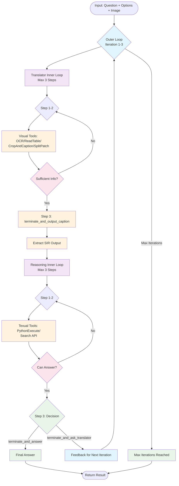

# Iterative Refinement Flow Workflow Documentation

## Overview

The Iterative Refinement Flow implements a sophisticated two-loop architecture for visual question answering through iterative collaboration between a Translator Agent and a Text-Only Reasoning Agent. **The system's core innovation is the SIR (Structured Intermediate Representation) - a dynamically evolving textual representation of visual content that serves as the bridge between visual analysis and reasoning.**

Both agents maintain conversation memory across iterations, while **the flow orchestrates SIR evolution** - transforming raw visual observations into increasingly refined, feedback-enriched descriptions that enable precise reasoning and answer generation.

## Central Role of SIR (Structured Intermediate Representation)

**SIR serves as the dynamic backbone of the entire workflow**, acting as:

### 1. **Visual-to-Textual Bridge**
- Transforms raw visual content into structured, queryable text descriptions
- Enables text-only reasoning agent to "see" through textual representation
- Maintains spatial, numerical, and contextual relationships from visual content

### 2. **Iterative Knowledge Accumulation**
- **Flow-Managed Evolution**: The flow orchestrates SIR updates across iterations
- **Feedback Integration**: Reasoning agent feedback is appended directly to SIR for persistent context
- **Progressive Refinement**: Each iteration enhances SIR with more targeted visual details

### 3. **Cross-Agent Communication Medium**
```
Iteration 1: Translator → Initial SIR → Reasoning → Feedback
Iteration 2: Flow merges feedback into SIR → Translator refines → Enhanced SIR → Reasoning
Iteration 3: Flow manages final SIR refinement → Final answer
```

### 4. **Flow-Level State Management**
The flow maintains:
- `current_sir`: Active SIR being refined
- `previous_sir`: Context from previous iteration
- `_append_feedback_to_sir()`: Automatic feedback integration
- `_update_sir_history()`: SIR version tracking

## Architecture: Two-Loop System with Memory Persistence

### Outer Loop (Iterative Refinement)
- **Purpose**: Coordinate iterative feedback between translator and reasoning agents while managing SIR evolution
- **Max Iterations**: 3
- **SIR Orchestration**: Flow maintains and updates the evolving SIR across iterations
- **Memory Management**: Both agents preserve conversation history across iterations
- **Termination**: Final answer from reasoning agent OR max iterations reached

### Inner Loop (Agent Execution)
- **Purpose**: Each agent's multi-step tool-based execution with SIR contribution
- **Max Steps**: 3 per agent
- **SIR Impact**: Translator generates/refines SIR; Reasoning consumes and provides feedback for SIR
- **Memory State**: Step counter resets, but conversation memory and SIR context persist
- **Termination**: Agent calls appropriate terminate tool

## Mermaid Flow Diagram



## Text-Based Flow Chart

```
┌─────────────────────────────────────────────────────┐
│            ITERATIVE REFINEMENT FLOW               │
│              (Memory-Aware System)                 │
└─────────────────────────────────────────────────────┘

Input: Question + Options + Image
           │
           ▼
    ┌─────────────────────────────────────────────────┐
    │          OUTER LOOP (Max 3 Iterations)         │
    │                                                 │
    │  ┌───────────────────────────────────────────┐  │
    │  │      TRANSLATOR INNER LOOP (Max 3 Steps)  │  │
    │  │                                           │  │
    │  │  Step 1-2: Visual Analysis               │  │
    │  │  ├─ OCR/ReadTable/CropAndCaption         │  │
    │  │  ├─ Check: Sufficient Info?              │  │
    │  │  └─ If No: Continue to next step         │  │
    │  │                                           │  │
    │  │  Step 3: terminate_and_output_caption     │  │
    │  │  └─ Generate SIR Output                  │  │
    │  └───────────────────────────────────────────┘  │
    │                    │                            │
    │                    ▼                            │
    │  ┌───────────────────────────────────────────┐  │
    │  │      REASONING INNER LOOP (Max 3 Steps)   │  │
    │  │                                           │  │
    │  │  Step 1-2: Analysis & Reasoning          │  │
    │  │  ├─ PythonExecute/Calculation             │  │
    │  │  ├─ Check: Can Answer?                    │  │
    │  │  └─ If No: Continue analysis              │  │
    │  │                                           │  │
    │  │  Step 3: Decision                         │  │
    │  │  ├─ terminate_and_answer → Final Answer   │  │
    │  │  └─ terminate_and_ask_translator → Feedback │  │
    │  └───────────────────────────────────────────┘  │
    │                    │                            │
    │              ┌─────┴─────┐                      │
    │              ▼           ▼                      │
    │    ┌─────────────┐ ┌─────────────┐             │
    │    │Final Answer │ │  Feedback   │             │
    │    │   (End)     │ │(Next Iter.) │─────────────┤
    │    └─────────────┘ └─────────────┘             │
    └─────────────────────────────────────────────────┘
           │
           ▼
    ┌─────────────────┐
    │ Return Result   │
    └─────────────────┘
```

## Detailed Component Breakdown

### 1. Flow Initialization
```python
# Input parsing
question, options, image_path = _parse_input(input_text, image_path)

# Image setup
_setup_image(image_path)  # Load & encode to base64
```

### 2. Outer Loop Execution

#### Iteration Structure
```python
for iteration in range(1, max_iterations + 1):  # Max 3 iterations
    try:
        # Prepare iteration isolation to prevent bug propagation
        await _prepare_iteration_isolation(iteration)

        # Reset memory but preserve previous SIR context
        _reset_agent_memory_for_iteration(translator, iteration)
        _reset_agent_memory_for_iteration(reasoning, iteration)

        # Inner Loop 1: Translator generates/refines SIR under flow orchestration
        sir_result = await _run_translator_inner_loop(question, options, iteration)
        _update_sir_history(sir_result)  # Flow tracks SIR evolution

        # CRITICAL: Flow synchronizes its SIR with translator's evolving SIR
        if translator.current_sir:
            flow.current_sir = translator.current_sir  # Bidirectional sync

        # Inner Loop 2: Reasoning consumes flow-managed SIR
        reasoning_result, decision = await _run_reasoning_inner_loop(question, options, iteration)

        # Decision handling with AUTOMATIC SIR feedback integration
        if decision == "FINAL_ANSWER":
            return reasoning_result  # Final answer achieved
        elif decision == "CONTINUE_WITH_FEEDBACK" and iteration < max_iterations:
            _append_feedback_to_sir(reasoning_result)  # Flow enriches SIR with feedback
            # Next iteration will use this feedback-enriched SIR
            continue
        else:
            return reasoning_result
    except Exception as iteration_error:
        # Isolate iteration errors and attempt recovery
        if iteration == max_iterations or _is_critical_error(iteration_error):
            return _finalize_with_error(session_id, error)
        await _recover_from_iteration_failure(iteration, iteration_error)
        continue
```

### 3. Inner Loop 1: Translator Agent

#### Purpose
Convert visual content to structured textual description (SIR - Structured Intermediate Representation) **under flow orchestration**. The translator doesn't just generate SIR - it collaborates with the flow to evolve SIR across iterations based on reasoning feedback.

#### Input Preparation
- **First Iteration**: Raw question + options + image path
- **Subsequent Iterations**: Question + previous SIR + reasoning feedback + image path

#### Agent Execution Flow
1. **Reset Step Counter**: `current_step = 0` (memory preserved)
2. **Memory Update**:
   - Iteration 1: Add question + options + image with base64
   - Iteration 2+: Merge context with SIR improvement task including reasoning feedback
3. **Multi-Step Execution**: Agent runs up to 3 steps with full conversation context
   - **Step 1**: Analyze image directly or decide on tool usage
   - **Step 2**: Execute tools (SmartGridCaption, OCR, ReadTable)
   - **Step 3**: Consolidate observations and call `terminate_and_output_caption`
4. **SIR Management**: Agent maintains evolving SIR throughout iterations **while flow synchronizes and tracks changes**
5. **Flow SIR Synchronization**: `flow.current_sir = translator.current_sir` after each iteration
6. **Result Extraction**: Prioritize tool-stored JSON, fallback to raw output

#### Available Tools
- **SmartGridCaption**: Intelligent image analysis with grid-based approach for comprehensive visual understanding
- **OCR**: Text extraction from images
- **ReadTable**: Structured table parsing
- **terminate_and_output_caption**: Output final SIR in JSON format

#### Output
```json
{
  "global_caption": "Comprehensive visual description including all text, numbers, layouts, objects, and spatial relationships"
}
```

### 4. Inner Loop 2: Reasoning Agent

#### Purpose
Analyze the **flow-managed SIR** and either provide final answer or request additional visual information. The reasoning agent operates purely on SIR provided by the flow, not directly on visual content.

#### Input
Current SIR + Question + Options

#### Agent Execution Flow
1. **Reset Step Counter**: `current_step = 0` (memory preserved)
2. **Memory Update**:
   - Iteration 1: Add question + options context, then add SIR from visual analysis
   - Iteration 2+: Add only new SIR from visual analysis (iteration N)
3. **Multi-Step Execution**: Agent runs up to 3 steps with full conversation context
   - **Step 1**: Analyze SIR sufficiency against previous attempts
   - **Step 2**: Perform calculations/reasoning building on previous work
   - **Step 3**: Make termination decision
4. **Decision Output**: Call appropriate termination tool

#### Available Tools
- **PythonExecute**: Perform calculations, data processing
- **terminate_and_answer**: Provide final answer (ends outer loop)
- **terminate_and_ask_translator**: Request more visual details (continues outer loop)

#### Decision Logic
```python
if sufficient_information_available:
    terminate_and_answer(final_answer)  # → FINAL_ANSWER
else:
    terminate_and_ask_translator(specific_feedback)  # → CONTINUE_WITH_FEEDBACK
```

### 5. Enhanced Error Handling and Recovery

#### Iteration Isolation
- **Purpose**: Prevent bug propagation between iterations
- **Implementation**: Each iteration starts with clean agent states and connection pools
- **Recovery Strategies**: Connection errors, memory/token limits, tool/parsing errors

#### Retry Logic
- **Agent Execution**: Automatic retry for truncated tool calls (up to 2 retries)
- **Tool Call Validation**: Detection of invalid/incomplete tool calls using existing parsing logic
- **Memory Cleanup**: Remove failed attempts to prevent pollution during retries

#### Critical vs Non-Critical Errors
- **Critical Errors**: Permission denied, authentication failed, file not found, syntax errors
- **Recoverable Errors**: Connection errors, timeouts, API errors, rate limits
- **Recovery Actions**: Connection pool reset, memory cleanup, tool state reset

### 6. FlowExecutor Integration

#### Modular Execution
- **FlowExecutor**: Convenience wrapper around the flow architecture providing benchmark integration
- **Configuration**: Uses config-driven parameters (max_iterations, max_steps)
- **Lazy Initialization**: Creates default agents when needed using existing agent classes
- **Result Format**: Detailed execution metadata including timing and success status

```python
# Example usage
executor = create_iterative_refinement_executor()
result = await executor.execute_async("Question with image\nimage_path: /path/to/image.jpg")
# Returns: {response, execution_time_seconds, success, error, flow_type, ...}
```

### 7. SIR (Structured Intermediate Representation) Management - THE CORE ORCHESTRATION

**SIR is the heart of the iterative refinement system.** The flow doesn't just coordinate agents - it actively manages, evolves, and enriches the SIR across iterations.

#### Flow-Centric SIR Lifecycle

**Phase 1: SIR Creation (Iteration 1)**
```python
# Translator generates initial SIR
translator_result = await _run_translator_inner_loop(question, options, 1)
_update_sir_history(translator_result)  # flow.current_sir = translator_result

# Flow synchronizes with translator's internal SIR
if translator.current_sir:
    flow.current_sir = translator.current_sir  # Bidirectional sync
```

**Phase 2: SIR Enhancement (Iteration 2+)**
```python
# Before translator runs: Flow prepares enhanced SIR context
merged_input = f"""Your current SIR with reasoning feedback:
{flow.current_sir}

IMPROVEMENT TASK:
1. Analyze the reasoning feedback carefully
2. UPDATE your current SIR to address the feedback - don't start fresh
3. Focus on visual details that help answer: {question}"""
```

**Phase 3: Feedback Integration (After Each Reasoning Step)**
```python
# Flow automatically appends reasoning feedback to SIR
def _append_feedback_to_sir(feedback: str):
    self.current_sir = f"""{self.current_sir}

--- REASONING FEEDBACK ---
{feedback}"""
    # This creates persistent context for next iteration
```

#### SIR State Management by Flow
```python
class IterativeRefinementFlow:
    current_sir: Optional[str] = None      # Active SIR being refined
    previous_sir: Optional[str] = None     # Previous iteration context

    def _update_sir_history(new_sir: str):
        # Flow manages SIR versioning
        if self.current_sir:
            self.previous_sir = self.current_sir
        self.current_sir = new_sir

    def _setup_agent_memory():
        # Flow provides SIR context to agents
        if iteration > 1 and self.current_sir:
            # SIR with accumulated feedback becomes agent input
            merged_input = create_sir_improvement_task()
```

#### SIR-Driven Agent Coordination
- **Translator ↔ Flow**: Bidirectional SIR synchronization (`flow.current_sir ↔ translator.current_sir`)
- **Flow → Reasoning**: Flow provides enriched SIR as reasoning input
- **Reasoning → Flow**: Feedback automatically integrated into SIR for next iteration
- **Cross-Iteration**: Flow preserves and evolves SIR state across all iterations

#### Why Flow-Managed SIR is Critical
1. **Persistent Context**: Unlike agent memory which resets, SIR accumulates knowledge
2. **Feedback Integration**: Reasoning feedback becomes permanent part of visual description
3. **Progressive Refinement**: Each iteration builds upon enriched SIR, not starting fresh
4. **Cross-Agent Bridge**: Enables text-only reasoning on visual content through rich descriptions

### 8. Termination Tools

#### terminate_and_output_caption (Translator)
```python
# Parameters
{
    "global_caption": "Comprehensive visual description"
}

# Output: Ends translator inner loop
{
    "global_caption": "..."
}
# Note: Tool result is stored in translator.final_caption_json for extraction
```

#### terminate_and_answer (Reasoning)
```python
# Parameters
{
    "answer": "Final answer to the question"
}

# Effect: Ends entire outer loop
```

#### terminate_and_ask_translator (Reasoning)
```python
# Parameters
{
    "feedback": "Specific request for additional visual information"
}

# Effect: Continues to next outer loop iteration
# Output: "FEEDBACK: {specific request}"
```
